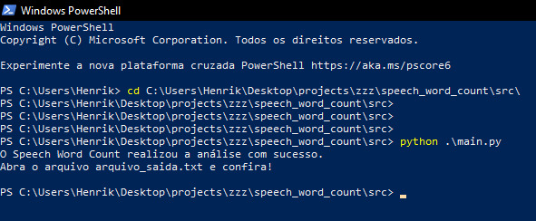
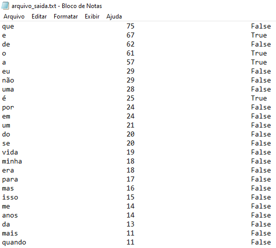

# Speech Word Count

## Descrição

Esta é uma ferramenta **simples** de análise léxica focada na identificação das palavras mais utilizadas em um texto.

O software possui um sistema de contagem de palavras e um rankeamento que exibe em ordem decrescente os termos mais usados.

- Algumas das possibilidades práticas de uso são:
    1. Melhorar o vocabulário da produção de um texto.
    
    1. Identificar vícios de linguagem.
    
    1. Detectar palavras que são palíndromas.

- Observações
    1. Este software aceita codificação de caracteres em `utf-8`.

    1. O software (no momento) funciona apenas via linha de comando (terminal ou PowerShell).

    1. Este software **não** é uma ferramenta de correção ortográfica.

## Demonstração sobre o funcionamento

### Comandos do PowerShell

- 

### Arquivo de saída

- 

Para melhor visualizar o modelo de demonstração, confira os arquivos `arquivo_entrada.txt` e `arquivo_saida.txt` que estão na pasta `src`.

### Sobre o arquivo que foi utilizado...

Neste arquivo é possível ver a análise sobre a versão traduzida do discursso do Steve Jobs, em 12 de junho de 2005, então presidente-executivo da Apple Computer e da Pixar Animation Studios. Nesta ocasião ele fez um discurso aos formandos da Universidade de Stanford, nos Estados Unidos. Texto extraído de: https://www.terra.com.br/noticias/tecnologia/internet/leia-o-discurso-de-jobs-aos-formandos-de-stanford,bc38d882519ea310VgnCLD200000bbcceb0aRCRD.html

### Sobre a análise do discurso de exemplo...

Trecho da análise extraído do arquivo `arquivo_saida.txt` (a análise na íntegra contém 763 linha).

|Palavra    |Menções no texto   |É um palíndromo?
|---        |---                |---
|que        |75                 |False
|e          |67                 |True
|de         |62                 |False
|o          |61                 |True
|a          |57                 |True
|eu         |29                 |False
|não        |29                 |False
|uma        |28                 |False
|é          |25                 |True
|por        |24                 |False
|em         |24                 |False
|um         |21                 |False
|do         |20                 |False
|se         |20                 |False
|**vida**   |**19**             |**False**
|minha      |18                 |False

Como pode ser observado, a palavra **vida** foi empregada **19 vezes** durante este discurso e **não é** um palíndromo.

## Instalando o software

### Instalação de dependencias

1. Python3 (instalado por padrão no Linux)

### Download

- Método via `Git` (recomendável)
    1. Abra o `terminal/PowerShell` e digite.
        > $ `git clone https://github.com/henrikbeck95/speech_word_count/`

- Médoto via `procedimento manual`
    1. Click no botão **Code**, em seguida click em **Download ZIP**.

    1. Descompacte a pasta `speech_word_count-main.zip`.
    
    1. Abra o `terminal/PowerShell` e acesse a pasta que foi descompactada do arquivo `speech_word_count-main.zip`.

- Observação
    1. O software `Speech Word Count` não necessita ser instalado para ser executado. Entretanto, é necessário ter instalado o interpretador da linguagem `Python` para que seja possível ser executado.

## Instruções de uso

### Antes de executar o software...

Para utilização correta do software, é melhor (mas não necessário) entender um pouco sobre a estrutura de arquivos do software.

- Na pasta **principal** está contido este arquivo `README.md` que é o manual de instruções.

- Na pasta `src` há vários arquivos.
    - O arquivo `main.py` é o arquivo que inicializará o software.

    - O arquivo `arquivo_entrada.txt` é onde você deverá inserir o texto que deseja realizar a análise.

    - O arquivo `arquivo_saida.txt` é onde o será exibido o resuldado da sua análise.

    - Quanto as demais arquivos, são funcionamento do software.

### Executando o software...

É nessesário acessr a pasta `src` pelo `terminal/PowerShell` para poder executar o arquivo.

- Linux
    > $ `cd ./speech_word_count/mine/src/`
    
    > $ `chmod +x ./main.py`
    
    > $ `python ./main.py`

- Windows
    > $ `cd .\speech_word_count\mine\src\`
    
    > $ `python .\main.py`
